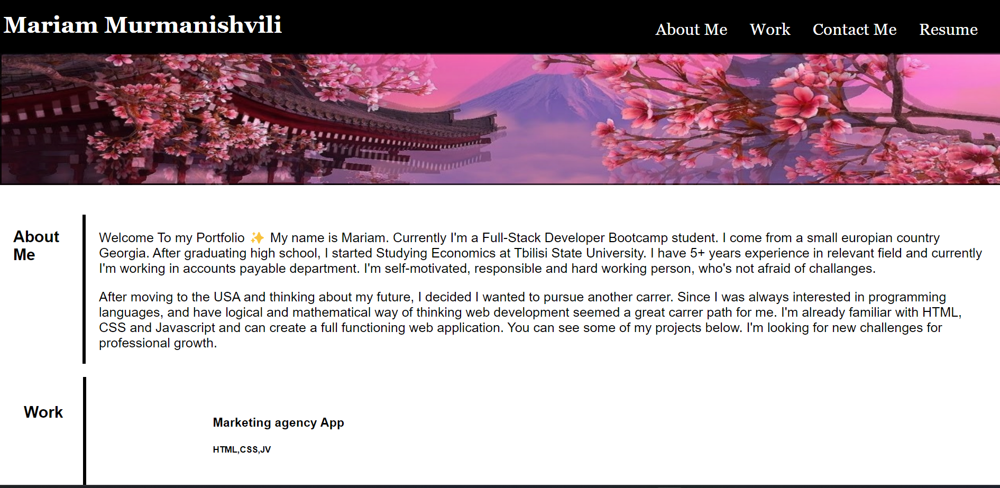

# my-portfolio

## Description

This website is a portfolio containing previous projects created by me. The application contains general information about me, my projects and contact-me information. 

## Installation

N/A

## Usage
To use this Website, guest can find a navigation bar at the right top of website. They can click on the topic they are interested in and UI will take them to that part. 

When scrolled down guest can see a box containing information "About Me" and below are boxes with names of completed project. Once clicked on the image they will take the guest to deployed URL of the named project. 

On the bottom right side of footer navigation can be found information on how to contact me. 

Once page is resized, smaller images will stack up in a column.

Website URL: https://misachka.github.io/my-portfolio/

## Credits

Used assigment 1 for code layout example. 
Used code for Hover: https://stackoverflow.com/questions/15275344/light-up-image-on-hover

## License

Please refer to the LICENSE in the repo.
